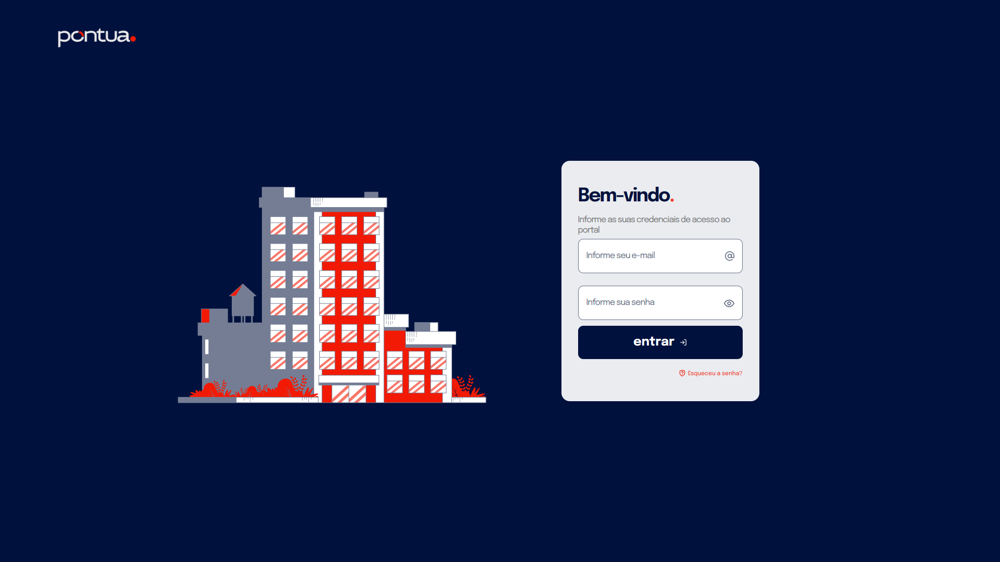
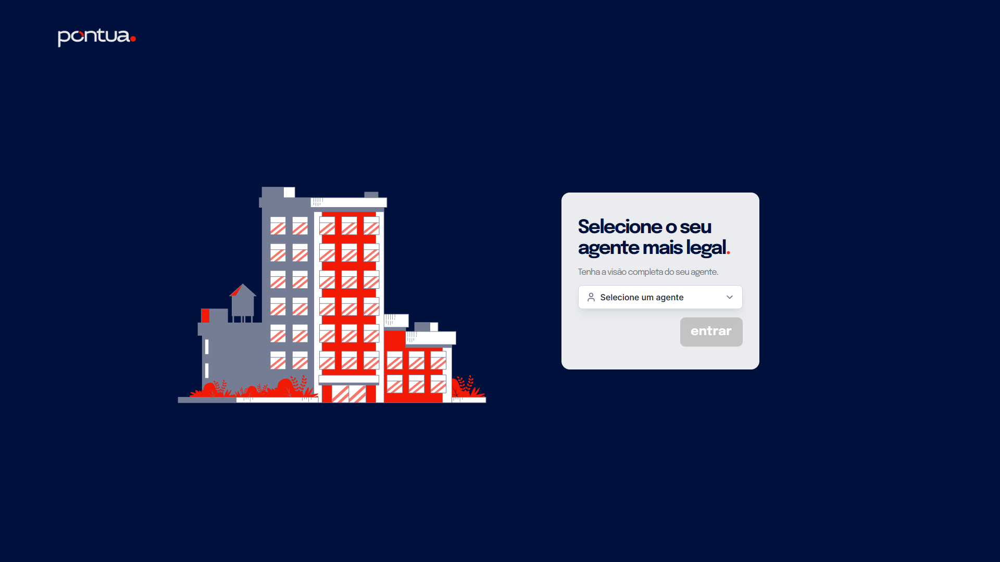
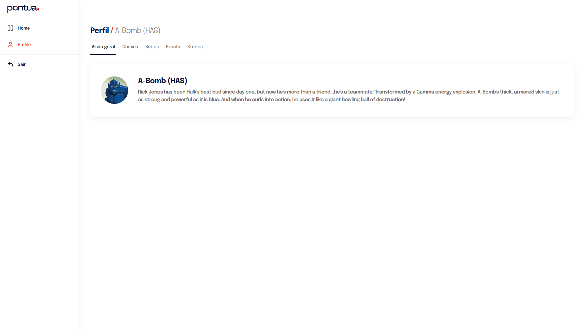
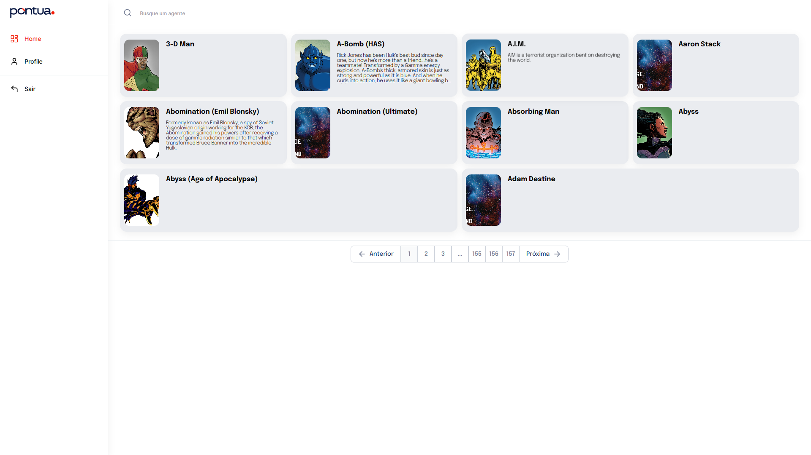
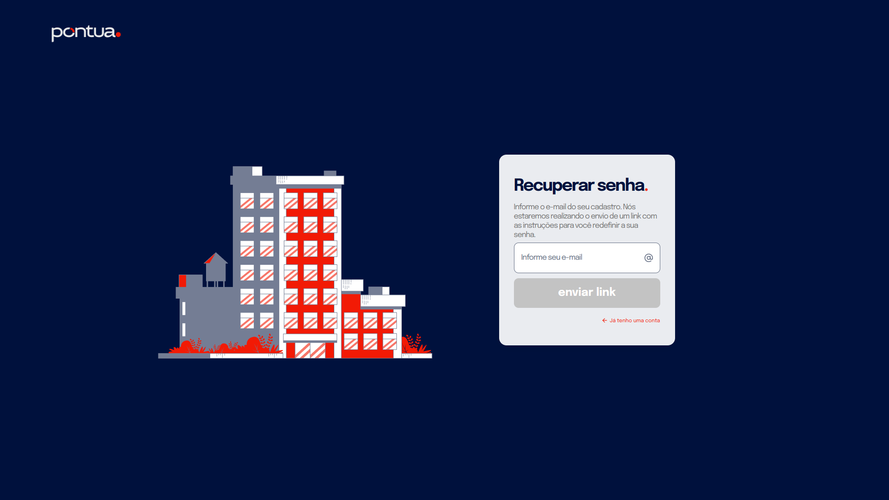
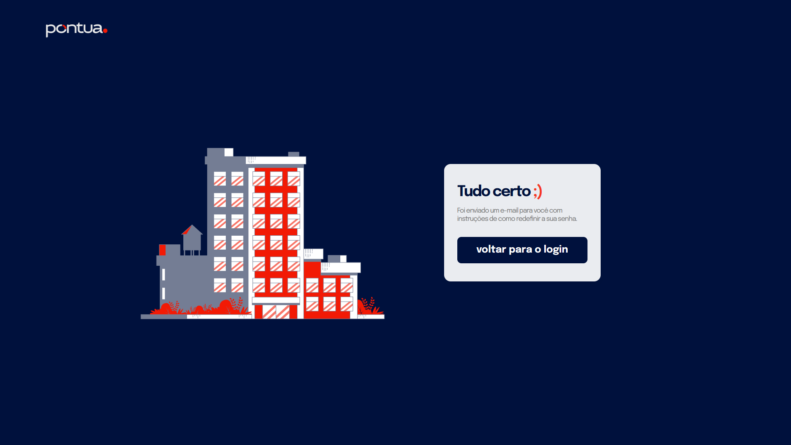
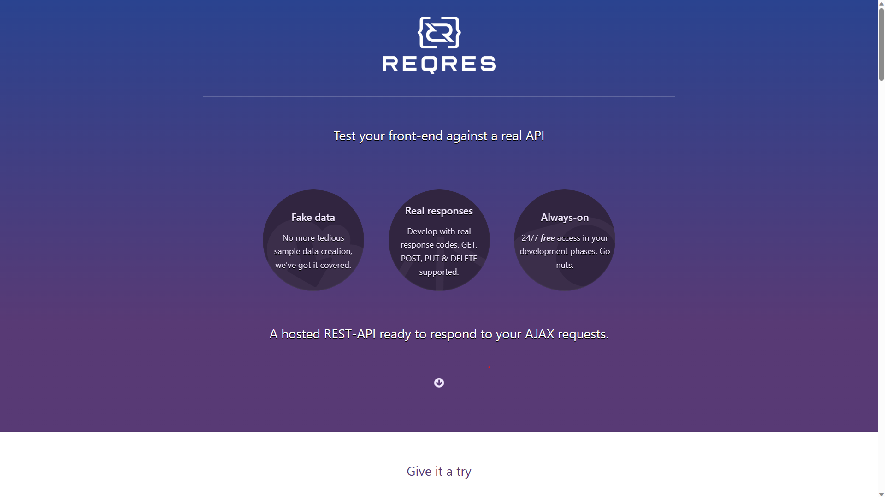

# _Teste Desenvolvimento Pontua Web_

> Esse é o teste para desenvolvedores na Pontua Web.<br>
> Sinta-se livre para editar a partir do título "Documentação da Aplicação".<br>
> Essa aplicação deve ser criada com base e utilização na api fornecida pela Marvel

## [https://developer.marvel.com/](https://developer.marvel.com/)<br>

> Qualquer dúvida poderá ser enviada por e-mail em tecnologia@pontua.com.br;<br>
> O prazo para finalização do teste deverá ser fornecido pelo RH;<br> >**_Não deixe de entregar sua aplicação_** mesmo que não esteja pronta ou perfeita;<br>
> A entrega do código deverá ser feita no GitHub e após o término, notificar o time através dos e-mails [tecnologia@pontua.com.br](mailto:tecnologia@pontua.com.br) e [gente@pontua.com.br](mailto:gente@pontua.com.br).

---

> Link para layout no [Figma]('https://www.figma.com/file/QFEzv3O4PWCzmvicy7e7sm/Teste-de-Desenvolvimento?node-id=0-1&t=D2fOR8TxhmRi52td-0').

---

## Página de Login

**_Eu como usuário:_**<br>

> Irei inserir o meu e-mail e senha de acesso para navegar para a tela de Agentes.

**_Quando eu:_**<br>

> Clicar no botão entrar, se sucesso deverá navegar para a próxima tela, caso ocorra erro, ver uma notificação;<br>
> Informando que o email ou senha está inválido.

### _Opcional_

> Quando eu clicar deverá redirecionar para a tela de esqueci minha senha.

### _Critérios de aceite_

> - Validação de e-mail e senha;
> - Navegar para próxima página;
> - Exibir mensagem de erro;
> - Ser o mais fiel possível ao layout do Figma.

---

## Página de seleção de Agente

**_Eu como usuário:_**<br>

> Irei selecionar o agente de minha escolha para acessar a página de perfil do agente.

**_Quando eu:_**<br>

> Clicar no campo de escolha deverá ser exibido uma lista com os nomes e foto do perfil de cada agente,
> e ao clicar no botão entrar ser redirecionado para a tela de perfil do agente;

### _Critérios de aceite_

> - Se não houver agente selecionado mostrar o placeholder "Selecione um agente" conforme Figma;
> - Se já exibir um agente selecionado e eu clicar no campo de escolha, exibir a lista de agentes com uma flag no agente já selecionado;
> - Ao clicar no botão entrar deverá navegar para a página de perfil do agente selecionado;
> - Ser o mais fiel possível ao layout do Figma.

---

## Página de Perfil de Agente

**_Eu como usuário:_**<br>

> Ao acessar a tela preciso ver a aba de visão geral com o descritivo sobre o agente,
> bem como seu nome e imagem;<br>
> Quero poder navegar nas abas de características, conforme layout do Figma;<br>
> Preciso visualizar o menu com as opções de acessar a Home, Perfil e sair do sistema.

**_Quando eu:_**<br>

> Clicar em uma das abas disponíveis daquele agente, preciso ver uma lista com as informações daquela aba.

### _Critérios de aceite_

> - Exibir as informações dos agentes;
> - As abas do perfil devem ser dinâmicas de acordo com cada agente;
> - Ao clicar nas abas mostrar as listagens com as informações relativas;
> - Exibir o menu lateral com link para Home, Perfil e Logout;
> - Ser o mais fiel possível ao layout do Figma;

---

## Página Home

**_Eu como usuário:_**<br>

> Desejo visualizar uma lista de cards com fotos de perfil e um resumo de personagens;<br>
> Quero poder navegar na lista pela paginação no final da página;<br>
> Quando eu clicar no campo de pesquisa e digitar o nome do agente, me mostre somente os personagens que contém aquele termo buscado.

**_Quando eu:_**<br>

> Clicar no card do personagem, deverei ser redirecionado para a página de perfil do personagem escolhido;<br>
> Fizer uma busca, o sistema deverá exibir na lista somente os personagens que contém aquele nome.<br>
> Clicar no botão "Próxima" deverá exibir os próximos cards da lista (próxima página);<br>
> Clicar no botão "Anterior" deverá exibir os cards anteriores da lista (página anterior);<br>
> Quando eu clicar no botão com número de páginação, exibir os cards relativos aquela página selecionada.<br>

### _Critérios de aceite_

> - Exibir resumo e foto de perfil;
> - Listagem mínima de 11 personagens
> - Exibição de no mínimo na primeira página
> - Exibição de no máximo 10 personagens por página;
> - Ao clicar em um card ser redirecionado à página de perfil do mesmo;
> - Ser o mais fiel possível ao layout do Figma;

---

> # _Opcional_ \*

## Página Recuperação de Senha

**_Eu como usuário:_**<br>

> Irei inserir o email que realizei o cadastro na plataforma no campo disponivel e, clicarei no botão enviar link.

**_Quando eu:_**<br>

> Clicar no botão de enviar link, deverá aparecer a mensagem de envio com sucesso.

### _Critérios de aceite_

> - Ser o mais fiel possível ao layout do Figma;

---

# Documentação da Aplicação

> Estrutura dos principais arquivos e diretórios da aplicação:

```shell
src
├── app
│   ├── (private)
│   │   ├── dashboard
│   │   │   ├── components # componentes específicos da página de Dashboard
│   │   │   │   ├── List.tsx
│   │   │   │   └── Skeleton.tsx
│   │   │   ├── error.tsx # página responsável por exibir erros caso ocorram ao carregar a página de listagem
│   │   │   ├── loading.tsx # página responsável por exibir um `loading` enquanto os agentes estão sendo carregados
│   │   │   └── page.tsx # página de listagem de todos os agentes
│   │   ├── layout.tsx # layout padrão das páginas privadas
│   │   └── profile
│   │       └── [id]
│   │           ├── error.tsx # página responsável por exibir erros caso ocorram ao carregar a página de perfil
│   │           ├── loading.tsx # página responsável por exibir um `loading` enquanto o agente selecionado está sendo carregados
│   │           └── page.tsx # página de perfil de agente, busca o mesmo pelo seu `id` recebido via params
│   ├── (public)
│   │   ├── layout.tsx # layout padrão das páginas públicas
│   │   ├── password-resetted
│   │   │   ├── components # componentes específicos da página
│   │   │   │   └── ButtonSignIn.tsx
│   │   │   └── page.tsx # página de senha recuperada
│   │   ├── reset-password
│   │   │   ├── components # componentes específicos da página
│   │   │   │   └── ResetPasswordForm.tsx
│   │   │   └── page.tsx # página de recuperar senha
│   │   ├── select-hero # página privada que utiliza o `layout` de rotas públicas, por isso está localizada aqui
│   │   │   ├── components # componentes específicos da página
│   │   │   │   └── SelectHero.tsx
│   │   │   └── page.tsx # página de selecionar agente preferido após autenticação
│   │   └── sign-in
│   │       ├── components # componentes específicos da página
│   │       │   └── SignInForm.tsx
│   │       └── page.tsx # página de autenticação
│   ├── api
│   │   └── auth
│   │       └── [...nextauth]
│   │           └── route.ts # lógica de autenticação utilizando `next-auth`
│   └── layout.tsx # `layout` global da aplicação
├── components # diretório com componentes gerais da aplicação
│   ├── AvailableTabs.tsx
│   ├── Card.tsx
│   ├── Divider.tsx
│   ├── Form # componentes específicos de formulários
│   │   ├── Input.tsx
│   │   ├── Select.tsx
│   │   └── InputSearch.tsx
│   ├── Header.tsx
│   ├── HeroInfo.tsx
│   ├── Pagination.tsx
│   ├── Sidebar
│   │   ├── MenuItem.tsx # componente específico da Sidebar
│   │   └── index.tsx
│   └── Tab.tsx
├── constants
│   └── routes.ts # rotas da aplicação
├── contexts
│   └── useSearch.tsx # contexto responsável por buscar dados dos agentes e por gerenciar a paginação dos mesmos
├── middleware.ts # controle de acesso às rotas da aplicação
├── providers
│   └── NextAuthProvider.tsx # provê informações do usuário autenticado para toda a aplicação
├── services
│   └── api.ts # arquivo de configurações do `axios`, incluindo seus `interceptors`
├── styles
│   └── globals.scss # estilos globais
├── types
│   ├── hero.ts # tipos utilizados em vários arquivos
│   └── next-auth.d.ts # tipagem do usuário autenticado
└── utils
    └── functions.ts # funções úteis
```

## Principais tecnologias utilizadas e suas versões


## Fluxo de uso da aplicação - [**Pontua Heroes**](https://pontua-heroes.vercel.app/)

- Ao entrar na aplicação, o usuário verá a tela de `login` no sistema, com a opção de visualizar a senha digitada e suas validações;
  <h1 align='center'>
    
  </h1>

- Ao realizar seu `login`, o usuário verá a tela de seleção de agente favorito, dentre os 10 primeiros retornados pela api da `Marvel`;
  <h1 align='center'>
    
  </h1>

- Ao selecionar um agente o usuário é redirecionado para a página de visualização do perfil do agente selecionado;
  <h1 align='center'>
    
  </h1>

- Ao clicar no menu `Home`, será exibida uma lista com todos os heróis divididos em `N` páginas;
  <h1 align='center'>
    
  </h1>

- Ao clicar em um agente dentre os listados, verá a tela de perfil do mesmo;
- Ao clicar no menu `Perfil` estando na página `Home`, verá novamente o perfil do agente selecionado ao realizar `login`;
- Ao clicar em sair, o usuário será redirecionado novamente para a página de `login`.
- Ao clicar em `Esqueceu a senha?`, o usuário verá um novo formulário onde fornecerá um e-mail de recuperação;

  - Ao fornecer um e-mail e clicar em `enviar link`, o usuário verá uma tela de sucesso com o botão de `voltar para o login`;
    <h1 align='center'>
      
    </h1>
    <h1 align='center'>
      
    </h1>

  - Essa opção está totalmente `mockada` pois a api mock escolhida para este teste, a [[`reqres.in`](https://reqres.in/)] não conta com um mock para recuperação de senha.
    <h1 align='center'>
      
    </h1>

## Como testar localmente

```shell
$ git clone git@github.com:vagnereix/pontua-heroes.git

$ cd pontua-heroes

$ pnpm install

# Caso eu já tenha retirado o arquivo original `.env`, copie o arquivo `.env.template` localizado na raiz do projeto para um novo arquivo `.env` ou `.env.local`, e o preencha com suas variáveis de ambiente

$ pnpm dev

# Para testar a versão de `build`
$ pnpm build

$ pnpm start

```

A aplicação também está disponível [**aqui**](https://pontua-heroes.vercel.app/).
